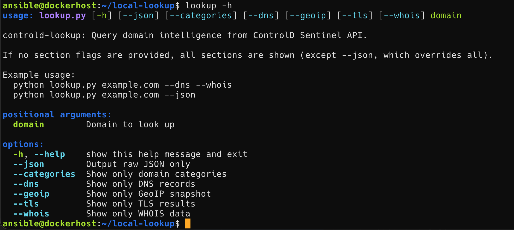

# ControlD Domain Lookup CLI

This is a Python CLI tool to query the [ControlD Dragonfly URL Filtering](https://controld.com/tools/dragonfly-url-filtering) API and display domain intelligence in a readable, colorized table format or as raw JSON.

## Features
- Lookup and display:
  - Domain categories
  - DNS records
  - GeoIP snapshot
  - TLS results
  - WHOIS data
- Output is colorized and formatted as tables using pandas/tabulate
- Supports output as raw JSON with `--json`
- Show only specific sections with flags: `--categories`, `--dns`, `--geoip`, `--tls`, `--whois`
- No Authorization token required (public API)

## Usage
1. **Clone this repository and enter the directory:**
   ```sh
   git clone <your-repo-url>
   cd controld-lookup
   ```
2. **Create a virtual environment and install dependencies:**
   ```sh
   python3 -m venv venv
   source venv/bin/activate
   pip install -r requirements.txt
   ```
   Or install manually:
   ```sh
   pip install requests pandas tabulate termcolor
   ```
3. **Run the script:**
   ```sh
   python lookup_domain.py <domain>
   ```

### CLI Options

```
python lookup_domain.py <domain> [options]

Options:
  --json           Output full JSON response only (no formatting)
  --categories     Show only domain categories
  --dns            Show only DNS records
  --geoip          Show only GeoIP snapshot
  --tls            Show only TLS results
  --whois          Show only WHOIS data

If no section flags are provided, all sections are shown (except --json, which overrides all).
```

### Examples

Show all info (default):
```
python lookup_domain.py example.com
```

Show only DNS and WHOIS:
```
python lookup_domain.py example.com --dns --whois
```

Show raw JSON output:
```
python lookup_domain.py example.com --json
```

## Notes
- This tool is for personal and educational use.
- For more information about ControlD and their services, visit [https://controld.com](https://controld.com)

## Disclaimer
This project is not affiliated with or endorsed by ControlD. Use of the API is subject to ControlD's terms of service.
